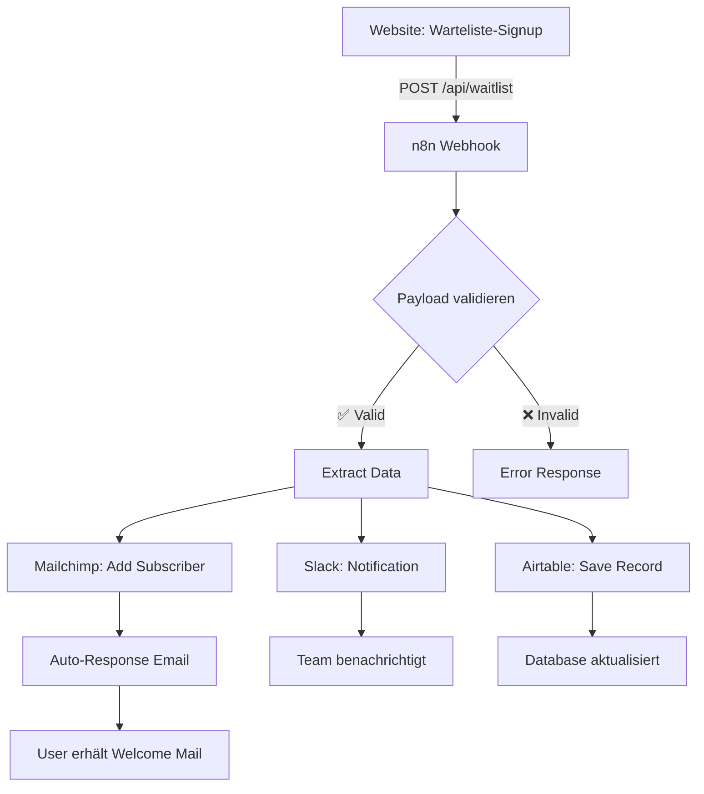

# 🔗 n8n Workflow - Saimôr Warteliste

## Workflow-Übersicht



---

## 🔧 n8n Setup

### **1. Webhook Node erstellen**

**Settings:**
- **Webhook URL:** `https://n8n.saimor.world/webhook/waitlist`
- **HTTP Method:** POST
- **Authentication:** None (oder Basic Auth für Sicherheit)
- **Response Mode:** Respond Immediately

**Payload erwarten:**
```json
{
  "type": "waitlist_signup",
  "data": {
    "email": "user@example.com",
    "name": "Max Mustermann",
    "interests": ["mora-ai", "dashboards", "workshops", "orbit"],
    "locale": "de",
    "timestamp": "2025-10-28T20:15:00.000Z",
    "source": "saimor-website",
    "tags": ["early-access", "community"]
  }
}
```

---

### **2. Data Extraction (Set Node)**

**Extrahiere folgende Felder:**

```javascript
// Set Node Configuration
return [
  {
    json: {
      email: $json.data.email,
      name: $json.data.name,
      interests: $json.data.interests.join(', '),
      locale: $json.data.locale,
      timestamp: $json.data.timestamp,
      tags: $json.data.tags,
      // Generiere Wartelisten-Position (später mit DB ersetzen)
      position: Math.floor(Math.random() * 100) + 50
    }
  }
];
```

---

### **3. Mailchimp Integration**

**Node: Mailchimp → Add/Update Member**

**Configuration:**
- **List ID:** `early-access` (Mailchimp Liste erstellen)
- **Email:** `{{ $json.email }}`
- **Status:** `subscribed`
- **Merge Fields:**
  ```json
  {
    "FNAME": "{{ $json.name }}",
    "INTERESTS": "{{ $json.interests }}",
    "LOCALE": "{{ $json.locale }}",
    "POSITION": "{{ $json.position }}"
  }
  ```
- **Tags:** `{{ $json.tags }}`

**Alternativ: Brevo (ehemals SendInBlue)**
```javascript
// Brevo API Node
POST https://api.brevo.com/v3/contacts
Headers: { "api-key": "YOUR_API_KEY" }
Body: {
  "email": "{{ $json.email }}",
  "attributes": {
    "FIRSTNAME": "{{ $json.name }}",
    "INTERESTS": "{{ $json.interests }}",
    "LOCALE": "{{ $json.locale }}"
  },
  "listIds": [2], // Early Access List
  "updateEnabled": true
}
```

---

### **4. Slack Notification**

**Node: Slack → Send Message**

**Configuration:**
- **Channel:** `#community-signups`
- **Message:**
  ```
  🎉 *Neuer Wartelisten-Signup!*

  👤 Name: {{ $json.name }}
  📧 Email: {{ $json.email }}
  🎯 Interessen: {{ $json.interests }}
  🌍 Sprache: {{ $json.locale }}
  📊 Position: #{{ $json.position }}

  🕒 {{ $json.timestamp }}
  ```

**Alternativ: Discord Webhook**
```javascript
POST https://discord.com/api/webhooks/YOUR_WEBHOOK_ID
Body: {
  "content": "🎉 Neuer Wartelisten-Signup!",
  "embeds": [{
    "title": "{{ $json.name }}",
    "description": "{{ $json.email }}",
    "fields": [
      { "name": "Interessen", "value": "{{ $json.interests }}" },
      { "name": "Position", "value": "#{{ $json.position }}" }
    ],
    "color": 4886850
  }]
}
```

---

### **5. Airtable Database**

**Node: Airtable → Create Record**

**Configuration:**
- **Base:** `Saimor Community`
- **Table:** `Waitlist`
- **Fields:**
  ```json
  {
    "Email": "{{ $json.email }}",
    "Name": "{{ $json.name }}",
    "Interests": "{{ $json.interests }}",
    "Locale": "{{ $json.locale }}",
    "Position": "{{ $json.position }}",
    "Signup Date": "{{ $json.timestamp }}",
    "Status": "Pending",
    "Tags": "{{ $json.tags }}"
  }
  ```

**Airtable Base Setup:**

| Feldname | Typ | Beschreibung |
|----------|-----|--------------|
| Email | Email | Primary Key |
| Name | Single Line Text | Vollständiger Name |
| Interests | Multiple Select | mora-ai, dashboards, workshops, orbit |
| Locale | Single Select | de, en |
| Position | Number | Wartelisten-Position |
| Signup Date | Date | ISO-Timestamp |
| Status | Single Select | Pending, Beta, Active |
| Tags | Multiple Select | early-access, community |
| Notes | Long Text | Interne Notizen |

**Alternativ: Notion Database**
```javascript
// Notion API Node
POST https://api.notion.com/v1/pages
Headers: {
  "Authorization": "Bearer YOUR_TOKEN",
  "Notion-Version": "2022-06-28"
}
Body: {
  "parent": { "database_id": "YOUR_DB_ID" },
  "properties": {
    "Email": { "email": "{{ $json.email }}" },
    "Name": { "title": [{ "text": { "content": "{{ $json.name }}" }}] },
    "Interests": { "multi_select": [
      { "name": "mora-ai" }
    ]}
  }
}
```

---

### **6. Auto-Response Email (Welcome Mail)**

**Node: Gmail/SMTP → Send Email**

**Configuration (Deutsch):**
```
To: {{ $json.email }}
Subject: Willkommen bei Saimôr! 🌱

Hallo {{ $json.name }},

danke, dass du Teil unserer Early-Access Community bist!

Du bist jetzt auf der Warteliste. Position: #{{ $json.position }}

Was als nächstes passiert:
→ Wir entwickeln weiter (du bekommst Updates)
→ Ende November: Beta startet
→ Du bekommst 2 Wochen vorher persönlich Bescheid

Deine Benefits:
✨ Beta-Zugang (2 Wochen vor Launch)
💰 50% Lifetime-Rabatt auf Pro
🎯 Feature-Voting
💬 Direkter Team-Kontakt

Fragen? Antworten auf diese Mail.

Bis bald,
Marius & das Saimôr-Team

---
P.S.: Folg uns für Updates:
LinkedIn: linkedin.com/company/saimor
Twitter: twitter.com/saimor_world
```

**Configuration (Englisch):**
```
Subject: Welcome to Saimôr! 🌱

Hello {{ $json.name }},

thank you for joining our Early Access Community!

You're now on the waitlist. Position: #{{ $json.position }}

What happens next:
→ We continue building (you'll get updates)
→ End of November: Beta starts
→ You'll get 2 weeks advance notice

Your benefits:
✨ Beta access (2 weeks before launch)
💰 50% Lifetime discount on Pro
🎯 Feature voting
💬 Direct team access

Questions? Just reply to this email.

See you soon,
Marius & the Saimôr Team

---
P.S.: Follow us for updates:
LinkedIn: linkedin.com/company/saimor
Twitter: twitter.com/saimor_world
```

**Conditional Email (IF Node):**
```javascript
// IF Node: Check locale
if ($json.locale === 'de') {
  // Route to German Email
} else {
  // Route to English Email
}
```

---

## 🔐 Security & Error Handling

### **1. Basic Auth für Webhook (optional)**

```bash
# n8n Webhook Node → Authentication → Basic Auth
Username: saimor_webhook
Password: <generate-secure-password>
```

**Website API Update:**
```typescript
// app/api/waitlist/route.ts
const response = await fetch(n8nWebhookUrl, {
  method: 'POST',
  headers: {
    'Content-Type': 'application/json',
    'Authorization': 'Basic ' + btoa('saimor_webhook:password')
  },
  body: JSON.stringify({ ... })
});
```

---

### **2. Error Handling**

**IF Node: Validate Payload**
```javascript
// Check if required fields exist
if (!$json.data || !$json.data.email || !$json.data.name) {
  return {
    json: {
      error: 'Missing required fields',
      status: 400
    }
  };
}

// Check email format
const emailRegex = /^[^\s@]+@[^\s@]+\.[^\s@]+$/;
if (!emailRegex.test($json.data.email)) {
  return {
    json: {
      error: 'Invalid email format',
      status: 400
    }
  };
}

// All good
return { json: $json.data };
```

**Error Notification (zu Team):**
```javascript
// Slack Node (auf Error-Pfad)
POST to #tech-alerts
Message: "🚨 Warteliste-Webhook failed: {{ $json.error }}"
```

---

### **3. Rate Limiting (Spam-Schutz)**

**Function Node: Check Rate Limit**
```javascript
// Rate Limit: Max 5 Signups pro Stunde von gleicher Email
const redis = require('redis');
const client = redis.createClient();

const email = $json.data.email;
const key = `waitlist:${email}`;
const count = await client.get(key);

if (count && count >= 5) {
  return {
    json: {
      error: 'Rate limit exceeded',
      status: 429
    }
  };
}

await client.incr(key);
await client.expire(key, 3600); // 1 hour

return { json: $json.data };
```

---

## 📊 Analytics & Tracking

### **Google Sheets Integration (für Dashboard)**

**Node: Google Sheets → Append Row**

**Configuration:**
- **Spreadsheet:** `Saimor Analytics`
- **Sheet:** `Waitlist Signups`
- **Columns:**
  ```
  | Timestamp | Email | Name | Interests | Locale | Position | Source |
  ```

**Live Dashboard:**
- Google Sheets → Verknüpft mit Google Data Studio
- Real-time Charts: Signups over Time, Interest Distribution, Locale Split

---

### **Custom Metrics (für Môra Dashboard)**

**HTTP Request Node → POST to Môra Backend**
```javascript
POST https://voice.saimor.world/api/dashboard/metrics/waitlist
Headers: { "Authorization": "Bearer ADMIN_TOKEN" }
Body: {
  "metric": "waitlist_signup",
  "value": 1,
  "tags": {
    "interests": "{{ $json.interests }}",
    "locale": "{{ $json.locale }}"
  }
}
```

---

## 🧪 Testing

### **1. Test Payload senden**

```bash
# Curl Test
curl -X POST https://n8n.saimor.world/webhook/waitlist \
  -H "Content-Type: application/json" \
  -d '{
    "type": "waitlist_signup",
    "data": {
      "email": "test@example.com",
      "name": "Test User",
      "interests": ["mora-ai"],
      "locale": "de",
      "timestamp": "2025-10-28T20:00:00.000Z",
      "source": "saimor-website",
      "tags": ["early-access", "community"]
    }
  }'
```

---

### **2. n8n Test-Execution**

1. n8n Workflow öffnen
2. **Execute Workflow** → **Test Manually**
3. Test-Payload eingeben (siehe oben)
4. Prüfen:
   - ✅ Mailchimp: Subscriber added?
   - ✅ Slack: Message received?
   - ✅ Airtable: Row created?
   - ✅ Email: Welcome Mail sent?

---

### **3. Website Integration Test**

```javascript
// Browser Console (saimor.world)
fetch('/api/waitlist', {
  method: 'POST',
  headers: { 'Content-Type': 'application/json' },
  body: JSON.stringify({
    email: 'test@example.com',
    name: 'Test User',
    interests: ['mora-ai'],
    locale: 'de'
  })
}).then(r => r.json()).then(console.log);

// Expected Response:
// { success: true, position: 73, email: "test@example.com" }
```

---

## 📦 n8n Workflow Export

### **Workflow JSON (zum Importieren)**

```json
{
  "name": "Saimor Waitlist",
  "nodes": [
    {
      "name": "Webhook",
      "type": "n8n-nodes-base.webhook",
      "position": [250, 300],
      "parameters": {
        "path": "waitlist",
        "responseMode": "responseNode",
        "responseData": "firstEntryJson"
      }
    },
    {
      "name": "Extract Data",
      "type": "n8n-nodes-base.set",
      "position": [450, 300],
      "parameters": {
        "values": {
          "string": [
            { "name": "email", "value": "={{$json.data.email}}" },
            { "name": "name", "value": "={{$json.data.name}}" }
          ]
        }
      }
    },
    {
      "name": "Mailchimp",
      "type": "n8n-nodes-base.mailchimp",
      "position": [650, 200],
      "parameters": {
        "operation": "addMember",
        "list": "early-access",
        "email": "={{$json.email}}",
        "status": "subscribed"
      }
    },
    {
      "name": "Slack",
      "type": "n8n-nodes-base.slack",
      "position": [650, 400],
      "parameters": {
        "channel": "#community-signups",
        "text": "🎉 New Signup: {{$json.name}}"
      }
    }
  ],
  "connections": {
    "Webhook": {
      "main": [[{ "node": "Extract Data", "type": "main", "index": 0 }]]
    },
    "Extract Data": {
      "main": [
        [
          { "node": "Mailchimp", "type": "main", "index": 0 },
          { "node": "Slack", "type": "main", "index": 0 }
        ]
      ]
    }
  }
}
```

**Import-Anleitung:**
1. n8n öffnen
2. **Workflows** → **Import from File**
3. JSON einfügen
4. Credentials konfigurieren (Mailchimp API Key, Slack Token)
5. Activate Workflow

---

## 🚀 Production Checklist

- [ ] Webhook URL in `.env` gesetzt: `N8N_WAITLIST_WEBHOOK_URL`
- [ ] n8n Workflow aktiviert
- [ ] Mailchimp List "early-access" erstellt
- [ ] Slack Channel #community-signups erstellt
- [ ] Airtable Base "Saimor Community" erstellt
- [ ] Email-Templates (DE + EN) getestet
- [ ] Rate Limiting aktiviert (optional)
- [ ] Error-Notifications an #tech-alerts
- [ ] Test-Signup durchgeführt (eigene Email)
- [ ] Welcome-Mail erhalten & geprüft

---

**Workflow Status:** ✅ Ready to Deploy
**Last Updated:** 2025-10-28
